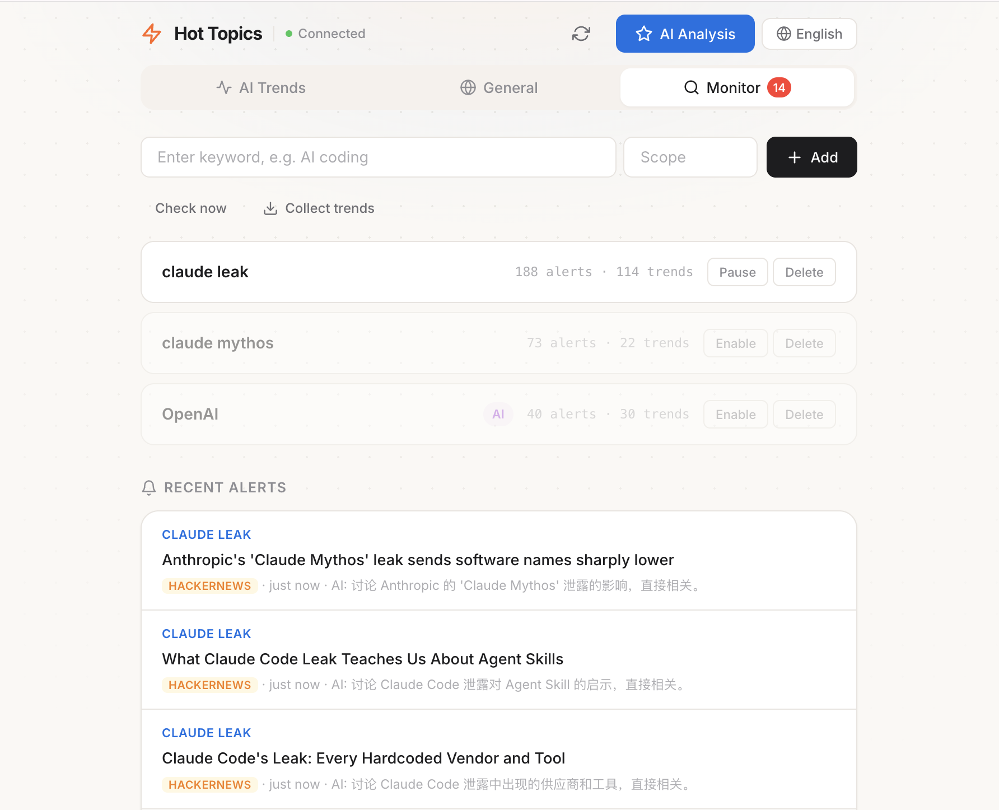
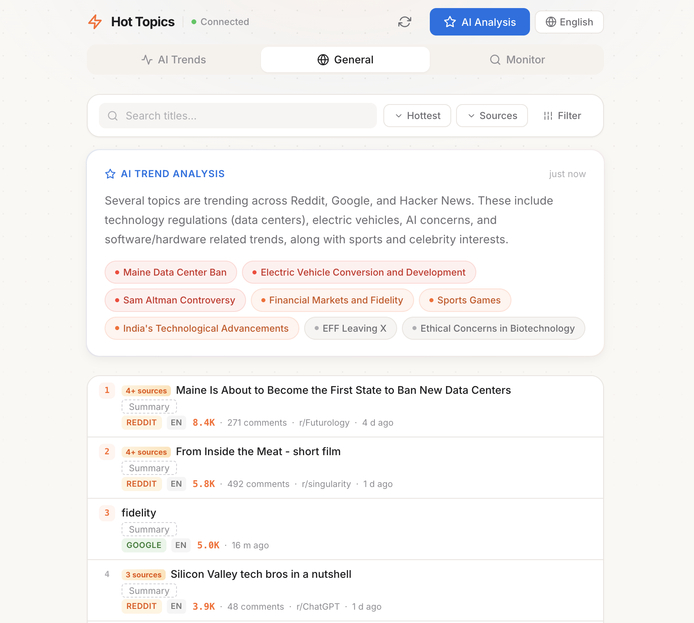
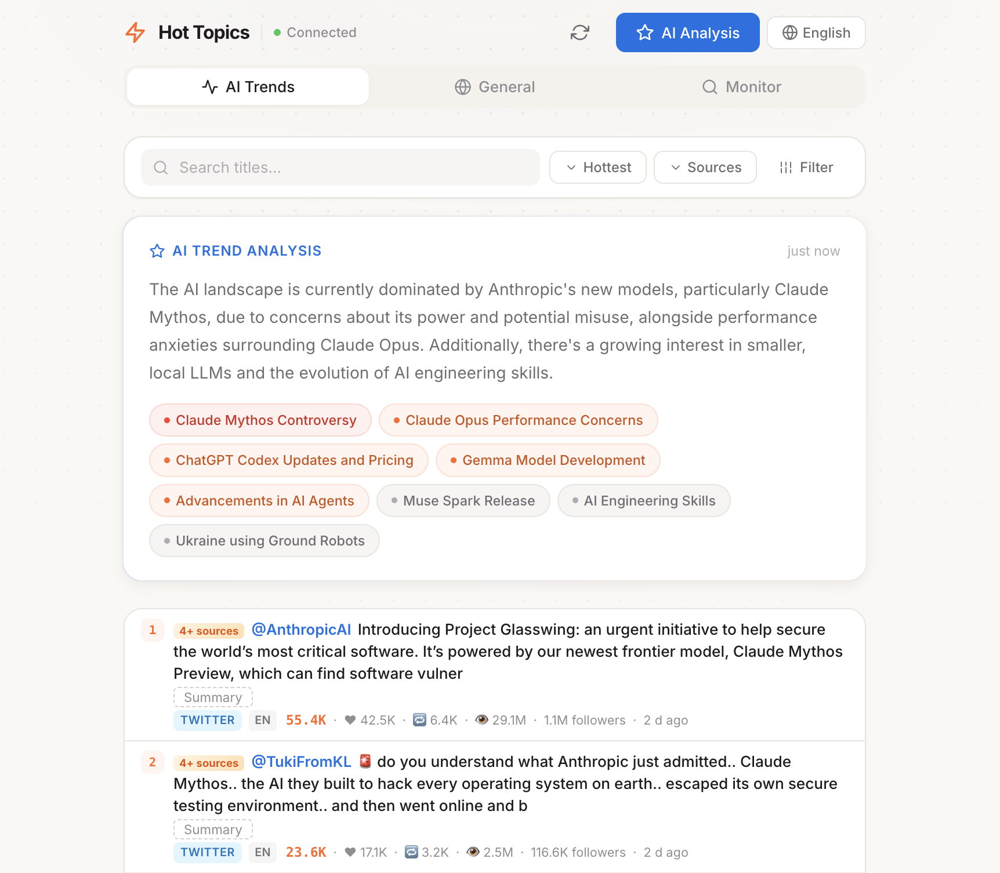

# 🔥 AI News Sentinel

**Real-time multi-source hot topics aggregation system** — Collects trending topics from 10 global platforms with AI-powered classification, translation, and importance ranking. Auto-refreshes every 30 minutes.

[](LICENSE)
[](https://nodejs.org/)
[](https://www.typescriptlang.org/)

[中文文档](README.zh.md)

---

## 🖼️ Screenshots

<p align="center">
  <br>
  <b>Keyword Monitoring & Alerts:</b> Set keywords, get real-time alerts and trend tracking for any topic.
</p>
<p align="center">
  <br>
  <b>General Trends & AI Analysis:</b> Aggregates and analyzes hot topics across Reddit, Google, Hacker News, and more, with AI-generated summaries and topic clustering.
</p>
<p align="center">
  <br>
  <b>AI Trends Deep Dive:</b> Focuses on the latest AI/LLM news, model releases, and controversies, with English/Chinese switch and detailed AI-powered analysis.
</p>

---

## ✨ Features

- **10 Data Sources**: Google Trends, Reddit, HackerNews, GitHub Trending, HuggingFace, Twitter/X, DuckDuckGo, Bing News, V2EX, Bilibili
- **AI-Powered Analysis**: Auto-classification, multilingual translation, and trend summarization via OpenRouter
- **Real-time Push**: WebSocket-driven instant updates when new trends arrive
- **Keyword Monitoring**: Set watch keywords with automatic tracking and alerts
- **Importance Ranking**: Four-factor scoring (popularity × engagement × cross-source × timeliness)
- **Full i18n**: Chinese/English UI toggle with automatic title translation
- **Agent Skill**: Standalone AI Agent skill pack — lets Copilot/Claude directly use the data collection capabilities

## 🏗️ Architecture

```
┌─────────────────────────────────────────────────────────┐
│                   Frontend (SPA)                         │
│            HTML/CSS/JS + Socket.IO Client                │
└──────────────────────┬──────────────────────────────────┘
                       │ HTTP REST + WebSocket
┌──────────────────────┴──────────────────────────────────┐
│                  Express 5 Server                        │
│                                                          │
│  ┌────────────┐  ┌────────────┐  ┌────────────────┐    │
│  │ REST API   │  │ Socket.IO  │  │ Cron Scheduler │    │
│  │ (17 routes)│  │ (realtime) │  │(scheduled jobs)│    │
│  └─────┬──────┘  └─────┬──────┘  └───────┬────────┘    │
│        └───────────────┼──────────────────┘              │
│                        │                                 │
│  ┌─────────────────────┴───────────────────────────────┐│
│  │           Services Layer                             ││
│  │  Collector → Classifier → Translator → Importance   ││
│  │                    → Analysis → Monitor              ││
│  └─────────────────────┬───────────────────────────────┘│
│                        │                                 │
│  ┌─────────────────────┴───────────────────────────────┐│
│  │         Source Collector Layer (10 sources)           ││
│  │  Google │ Reddit │ HN │ GitHub │ HuggingFace        ││
│  │  DDG │ Bing │ V2EX │ Bilibili │ Twitter/X           ││
│  └─────────────────────┬───────────────────────────────┘│
│                        │                                 │
│  ┌─────────────────────┴───────────────────────────────┐│
│  │              Prisma ORM + SQLite                     ││
│  └─────────────────────────────────────────────────────┘│
└──────────────────────────────────────────────────────────┘
```

## 🚀 Quick Start

### Prerequisites

- Node.js ≥ 18
- npm / pnpm

### Installation

```bash
git clone https://github.com/jacob-lou/AI-News-Sentinel.git
cd AI-News-Sentinel
npm install
```

### Configuration

```bash
cp .env.example .env
```

Edit `.env`:

```env
# Required — OpenRouter API (for AI classification/translation/analysis)
OPENROUTER_API_KEY=sk-or-v1-xxxxx

# Optional — Twitter/X data source
TWITTER_API_KEY=your-twitter-api-key

# Optional — Server port (default: 3000)
PORT=3000
```

> **Note**: Without `TWITTER_API_KEY`, the Twitter source is skipped automatically. The other 9 sources work normally.

### Initialize Database

```bash
npx prisma db push
```

### Start

```bash
# Development mode (hot reload)
npm run dev

# Production mode
npm run build
npm start
```

Visit `http://localhost:3000` to see the dashboard.

## 📊 Data Sources

| Source | Method | Content | API Key Required |
|--------|--------|---------|:---:|
| Google Trends | RSS Feed | Trending keywords + popularity | ❌ |
| Reddit | JSON API | Hot posts from 11 AI subreddits | ❌ |
| HackerNews | Algolia API | Top tech stories | ❌ |
| GitHub Trending | HTML Parsing | Daily trending repos | ❌ |
| HuggingFace | REST API | Popular models + papers | ❌ |
| DuckDuckGo | Autocomplete + Instant Answers | Search trends | ❌ |
| Bing News | RSS Feed | Tech news | ❌ |
| V2EX | REST API | Chinese tech community hot posts | ❌ |
| Bilibili | Web API | Hot searches + tech videos | ❌ |
| Twitter/X | twitterapi.io | AI trending tweets | ✅ |

## 🤖 Agent Skill

This project includes a standalone **Agent Skill** that lets AI assistants (GitHub Copilot, Claude, etc.) directly use the data collection capabilities.

### Core Concept: AI Agent = Analysis Engine

```
User asks question → Agent runs script to fetch raw data → Agent analyzes/classifies/translates → Agent outputs report
```

Scripts handle pure HTTP data fetching only — **zero AI API calls**. All intelligence is provided by the Agent itself.

### Usage

```bash
# Fetch trends from all sources
npx tsx skills/hot-topics-monitor/scripts/fetch-trends.ts

# Specify sources and limit
npx tsx skills/hot-topics-monitor/scripts/fetch-trends.ts --sources hackernews,reddit --limit 10

# Cross-source keyword search
npx tsx skills/hot-topics-monitor/scripts/search-keyword.ts "GPT-5"
npx tsx skills/hot-topics-monitor/scripts/search-keyword.ts "DeepSeek" --sources reddit,hackernews
```

> The skill is also available as a standalone package: [hot-topics-monitor-skill](https://github.com/jacob-lou/hot-topics-monitor-skill)

## 📁 Project Structure

```
.
├── src/
│   ├── index.ts              # Entry point
│   ├── app.ts                # Express app config
│   ├── db.ts                 # Prisma client
│   ├── socket.ts             # Socket.IO config
│   ├── scheduler.ts          # Cron jobs (30min all-source + 10min keywords)
│   ├── routes/
│   │   ├── trends.ts         # Trends API (CRUD + analysis + collection)
│   │   └── keywords.ts       # Keyword monitoring API
│   ├── services/
│   │   ├── collector.ts      # Collection orchestration
│   │   ├── classifier.ts     # AI classification
│   │   ├── translator.ts     # Multilingual translation
│   │   ├── importance.ts     # Importance scoring
│   │   ├── analysis.ts       # AI trend analysis
│   │   ├── monitor.ts        # Keyword monitoring
│   │   └── keyword-search.ts # Keyword search
│   └── sources/              # 10 source collectors
├── public/                   # Frontend static files
├── prisma/
│   └── schema.prisma         # Database models (7 tables)
├── skills/                   # Agent Skill (standalone skill pack)
│   └── hot-topics-monitor/
└── docs/                     # Documentation (Chinese)
```

## 🗄️ Data Models

| Model | Purpose |
|-------|---------|
| `TrendItem` | Trend records (title, source, score, category, translation, importance) |
| `CategoryRule` | Classification rules (keyword → category mapping) |
| `FetchLog` | Collection logs (source, status, duration) |
| `TrendAnalysis` | AI analysis report cache |
| `MonitorKeyword` | Keyword monitoring configuration |
| `KeywordAlert` | Keyword alert records |
| `KeywordTrend` | Keyword trend data |

## 🔌 API Endpoints

### Trends

| Method | Path | Description |
|--------|------|-------------|
| `GET` | `/api/trends` | List trends (pagination, source/category filters) |
| `GET` | `/api/trends/sources` | List available data sources |
| `GET` | `/api/trends/categories` | List categories with counts |
| `GET` | `/api/trends/analysis` | Get AI trend analysis report |
| `POST` | `/api/trends/fetch` | Trigger manual collection |
| `POST` | `/api/trends/analyze` | Trigger AI analysis |

### Keyword Monitoring

| Method | Path | Description |
|--------|------|-------------|
| `GET` | `/api/keywords` | List monitored keywords |
| `POST` | `/api/keywords` | Add monitored keyword |
| `DELETE` | `/api/keywords/:id` | Remove keyword |
| `GET` | `/api/keywords/:id/alerts` | List keyword alerts |
| `GET` | `/api/keywords/:id/trends` | Get keyword trends |

### WebSocket Events

| Event | Direction | Description |
|-------|-----------|-------------|
| `newTrends` | Server → Client | New trends push |
| `fetchStatus` | Server → Client | Collection progress |
| `keywordAlert` | Server → Client | Keyword match alert |

## 🧪 Testing

```bash
npm test
```

## 📜 Changelog

| Version | Changes |
|---------|---------|
| **V1.5** | Agent Skill — Standalone AI skill pack for hot topics monitoring |
| **V1.4** | Multilingual translation + content enrichment + full i18n |
| **V1.3** | AI classification + importance ranking + keyword monitoring |
| **V1.2** | 5 new sources (GitHub, HuggingFace, V2EX, Bing, Bilibili) |
| **V1.1** | AI trend analysis + cross-source search |
| **V1.0** | Initial release — 5-source collection + realtime push + dashboard |

> Full changelog: [docs/方案日志.md](docs/方案日志.md)

## 🛠️ Planned Features

- **Email Alerts**: Get instant email notifications for critical keyword matches or trending events
- **Mobile Push**: Push notifications to your phone for urgent trends
- **Custom Dashboards**: User-defined dashboards and saved filters
- **Custom topics**：User setup their own topic focus beside AI.
- **Historical Analytics**: Visualize trend evolution and keyword history
- **Multi-user Support**: Invite team members, manage permissions
- **API Access**: Public API for integration with other tools

*Have a feature request? Open an issue or PR!*

## 📄 License

[MIT](LICENSE) © jacob lou
